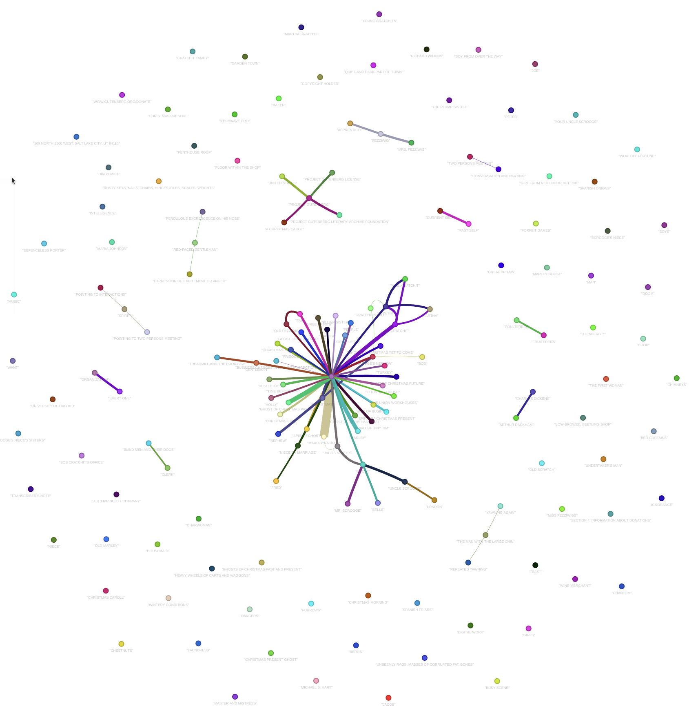
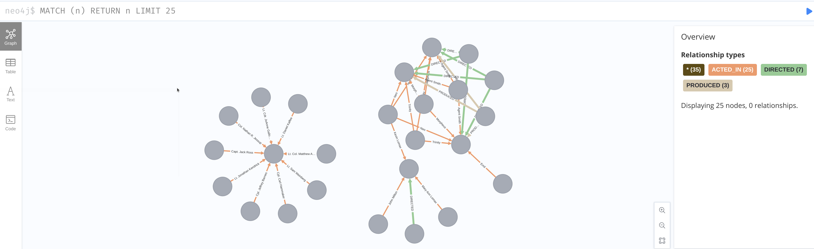
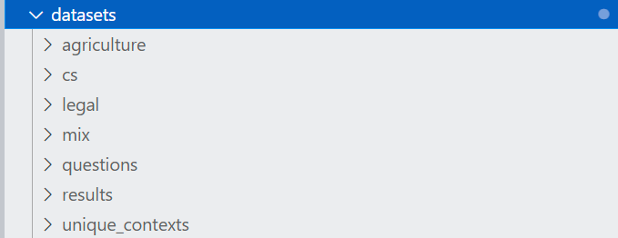
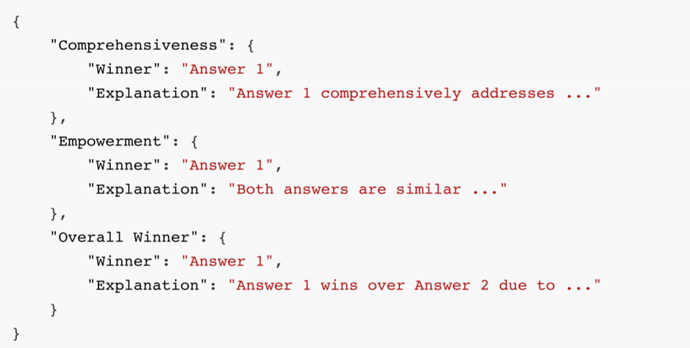

<center><h2>Implementation of Retrieval-Augmented Generation</h2></center>

This is our implementation of RAG system named SuperRAG.

## Prerequiresite
We assume the following software/packages are correctly installed.

* Ollama
* Neo4j

## Install

```bash
conda create -n superrag  -y
conda activate superrag
pip install torch==1.13.0+cu116 --extra-index-url https://download.pytorch.org/whl/cu116
pip install -r requirements.txt
pip install -e .
```

## Part 1: Example with Ollama Qwen LLM

* Download the demo text "A Christmas Carol by Charles Dickens":

```bash
curl https://raw.githubusercontent.com/gusye1234/nano-graphrag/main/tests/mock_data.txt > ./book.txt
```
* Increasing context size
In order to work context should be at least 32k tokens. By default Ollama models have context size of 8k. We extent the `num_ctx` paramter in the modelfile:

```bash
ollama pull nomic-embed-text
ollama pull qwen2
ollama show --modelfile qwen2 > Modelfile
PARAMETER num_ctx 32768 # Edit the Modelfile by adding this parameter
ollama create -f Modelfile qwen2m
```

* Run demo file
```bash
python3 examples_superrag/superrag_ollama_demo.py
```


## Part 2: Knowledge Graph Visualization

### Graph Visualization with HTML
In Part 1, we have generated chunks, entities and relationship by storing them under the folder './dickens'


* Run demo file
```bash
python3 examples_superrag/graph_visual_with_html.py
```
Then open the generated file 'knowledge_graph.html' in your brower to see the graph.

<div align="center">

<br />
<!-- <b>Graph Vis with</b> -->
</div>
<br>

### Graph Visualization with NEO4J

Before running demo, you need to set the 'NEO4J_URI', 'NEO4J_USERNAME' and 'NEO4J_PASSWORD' according to your own neo4j settings.

* Run demo file
```bash
python3 examples_superrag/graph_visual_with_neo4j.py
```
Then open your local Neo4j application to visualize the results accordingly.

<div align="center">

<br />
<!-- <b>Graph Vis with</b> -->
</div>
<br>


## Part 3: Evaluation Process

* Please download the mix, legal, cs and agriculture dataset from [ultradomain](https://huggingface.co/datasets/TommyChien/UltraDomain/tree/main).
* Put them accordingly under the folder './dataset' 

<div align="center">

<br />

</div>
<br>
In our experiment, we use mix dataset as example.

### Step 0: Preprocessing
```bash
python3 reproduce_superrag/Step_0.py
```
This step is used to preprocess the dataset accordingly.

### Step 1: RAG insertion
```bash
python3 reproduce_superrag/Step_1.py
```
This step is used to extract entities and insert into the RAG.
Our implementation is based on Soloar-Mini at UPSTAGE. By default you should set UPSTAGE_API_KEY into your OS environmental variables.


### Step 2: Question Prompt Generation
```bash
python3 reproduce_superrag/Step_2.py
```
This step is used to generate question prompts based on the datasets accordingly.

### Step 3: Results generation
```bash
python3 reproduce_superrag/Step_3.py
```
This step is used to generation answers of the question prompts from Step 2 based on the indexed RAG from Step 1.


### Step 4: Evaluation
```bash
python3 examples_superrag/batch_eval.py
```

Here we provide two results from two different LLM model, Solar-mini and gpt_4o_mini in this [link](https://mycuhk-my.sharepoint.com/:f:/g/personal/1155225591_link_cuhk_edu_hk/EiTnNUi3gatFrz9wIfzSN9UBFnJXA1hdOGAfVXJwg9FWUg?e=GUz8d3)

The comparison result will be generated.
<div align="center">

<br />

</div>
<br>


